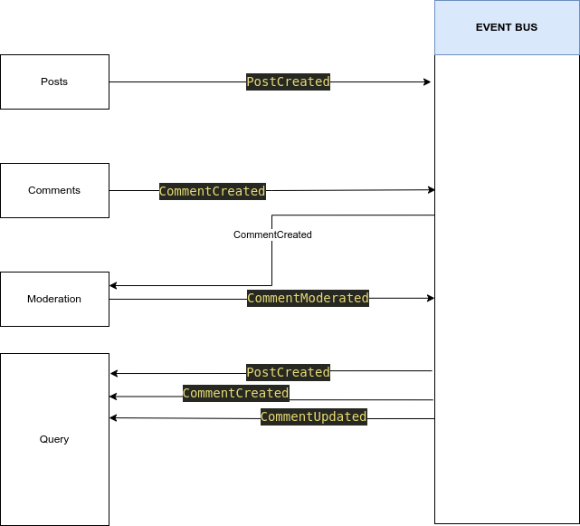

# Minimalistic Micro Services Example NodeJS

This example is only for very basic conceptual understandign without any sophistication and complexities.

Pre-Requisites

- Docker
- Minikube

Characteristics

- Each microservice has its own data store (In this example we are not using database for simplicity.)
- Each service is independantly deployable and scalable (Runs on own container).
- When a post is created PostCreated event is send to event bus.
- Event bus notifies other services
- When a comment is created CommentCreated event is send to event bus
- Event bus notifies other services about CommentCreated. Initially the comment will be in moderation pending status
- When Moderation service receives CommentCreatd event from the event bus, it moderates the comment and sends a CommentModerated event back to event bus
- When comment is moderated, event bus sends CommentUpdated event to Query service.
- All the events are stored in an event data store so that query service can catch up if it goes down and comes back again.



A note about event data store:

- Any event received by event-bus will be stored in an event data store. (Extremely large data store)
- query service will query event store
- when query service starts up , it catches up all events occured up to that time.This way if service goes down it can syncup events that occured when it was down.

apis

- posts => Represents a blog post.

  - When a post is created 'PostCreated' event is send to the event-bus

- comments => Comments under a post
- moderation => A service that moderates comments
- query => service that helps to get all posts at once. This also helps event catchup
- event-bus => Every time event-bus receives the following events:

  - PostCreated - When a Post is created
  - CommentCreated - When a comment is created.
  - CommentModerated - When a comment is moderated.
  - CommentUpdated - When a comment is updated.

- query service stores a replica of all posts and also receives events from event bus on everyevent.

client - A simple barebones recat app

Each api is dockerized.

The infr/k8s folder contains kubernetes configuration yaml files.

Each yaml file defines a deployment and a ClusterIP service

Only posts api is externally exposed and hence posts-svc.yaml represents the NodePort service for posts api

Ingress-nginx controller is used to handle routes

in the ingress-svc.yaml each route is routed to a specific backend service

Cloning & Building

- Clone this repository
- Build the docker images in respective folders
- Push docker images to docker hub
- Apply the yaml configurations by navigating to infra\k8s folder and issuing the command `kubectl apply -f .`

The react app has some problem that prevents it from worrking. Use postman instead.

Modify your hosts file (`/etc/hosts`) and route the traffic to posts.com to the `minikube ip`

```
<your minikube ip> posts.com

```

Using Skaffold (Only applicable at Dev phase)

It is a headache to develop if we have to build each and every image, push it to the registry and apply deploymnet. Skaffold automates and simplifies this process for development.

For information: Navigate to https://skaffold.dev/

### Added new relic APM support
